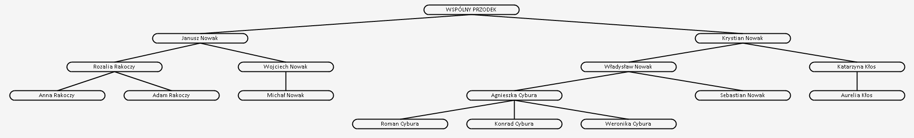

# Family Tree Viewer

FamilyTreeViewer is a desktop application for creating, editing and viewing a family tree. The project was created in C# using Windows Forms. 

## Running the application

The application is currently in progress. But if you want to see how it works, just copy the repository and build it in your IDE. The downloadable version will be available as soon as I am finished implementing other major features, e.g. special nodes. 

## Features

The application is divided into 2 main areas. The first, larger area is the workspace where we create nodes. 
The second, slightly smaller area is the interface that contains the fields for the selected node.

- The fields that are there allow you to provide the first name, last name, maiden name, name of the partner and provide additional information.

- The "Edycja(Edit)" checkbox prevents against accidental editing of the wrong node.

- When we find that the nodes are too far or close to each other, we can pull them apart or bring them closer with the help of prepared controls. 

- When a node is selected, the information appears on the right side of the window:

- We can also notice that the children of the selected node are listed in the appropriate field on the right. 

- The window is resizable, so you can adjust it to your monitor.

- Right-clicking on the workspace displays a popup menu for adding more nodes (child or parent) or deleting selected node:

- We can move freely around the working area, move the image, zoom in and out. 

- The program allows you to save the created tree as one of 4 types of files:
  - BMP
  - JPG
  - PNG
  - XML

The last option is especially interesting because saving the tree as an XML file allows you to load that file later and continue editing and creating that tree. 

## Example family tree

Sample family tree created in this application:

